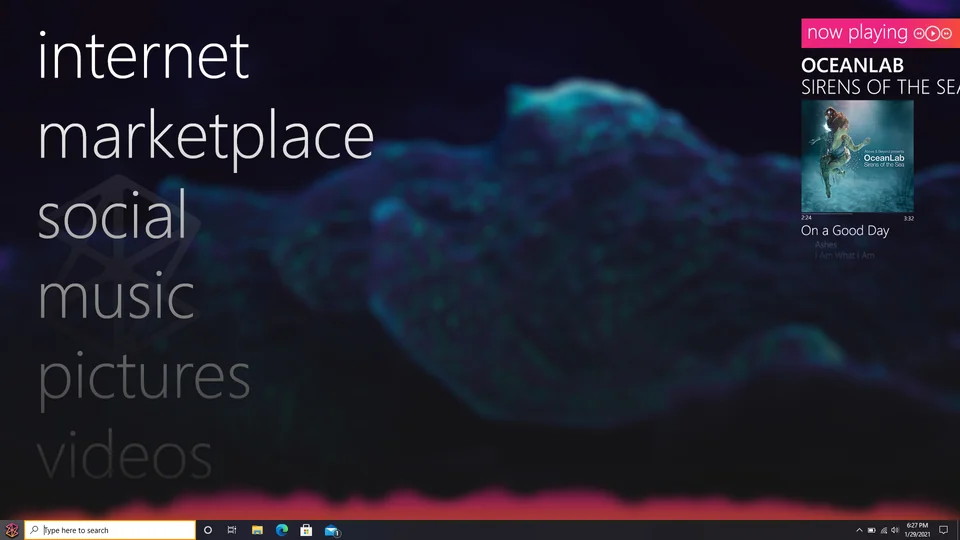
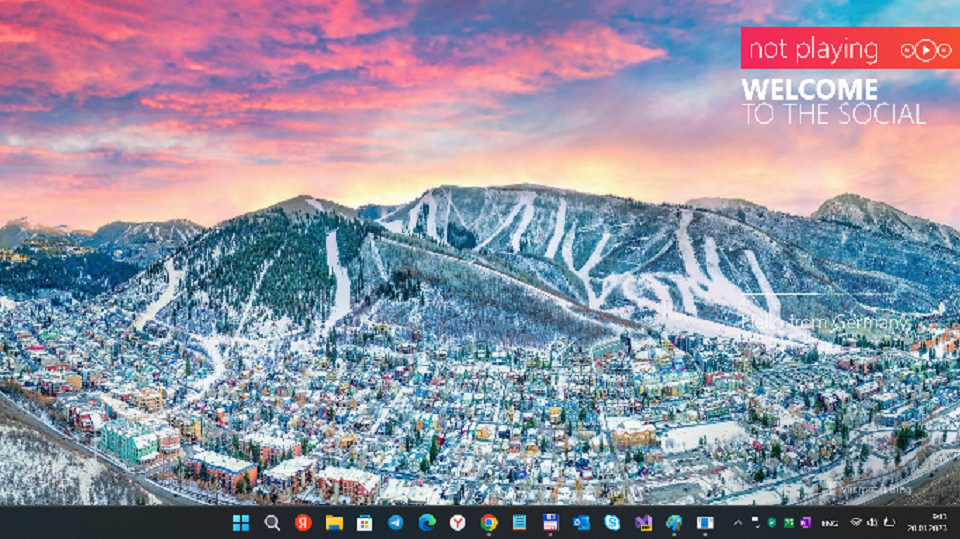

# ZuneDeskop
This is my fork of [ZuneDesk](https://github.com/PlatinShadow/ZuneDesk) project.

## About the original / What is ZuneDesk?
ZuneDesk is a desktop overlay for playing music. It's inspired by the Zune UI. 

## Concept / Realization

## Explore it / Build it
Use VS 2022 Preview to "download" (clone) this repo.
Explore some nice and simple "zune controls" and "desktop overlay" at all.
Add your own "zune-like" "apps" if you want to create the greate ZuneDesktop :))))

## Features
This is still in very early development, so there aren't many features.
But the overlay is already somewhat integrated with Windows APIs for getting information about the currently playing media. 

## Helping
If you find any bugs or would like to request a feature please open a new [issue](https://github.com/PlatinShadow/ZuneDesk/issues).

## Plans
- [x] System Media Transport Controls integration
- [ ] Audio Visualizer
- [ ] Audio File Playback?
- [ ] Spotify integration
- [ ] Zune Syncing?

## Acknowledgements
- Thanks to [this reddit post](https://www.reddit.com/r/Zune/comments/l8bu6r/windows_10_zune_start_menu_concept/) for inspiring me to do this!
- Thanks to microsoft for making the Zune :)
- Thanks to [Lars aka PlatinShadow](https://github.com/PlatinShadow) for making nice ZuneDesk "template" (desktop overlay) :)

## ..
AS IS. No support. RnD only / DIY

## .
MediaExplorer 2023
